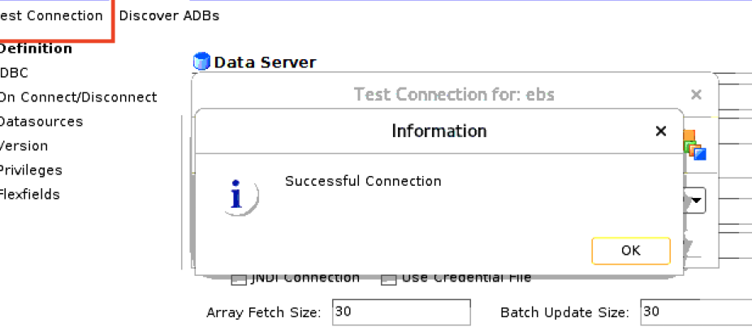
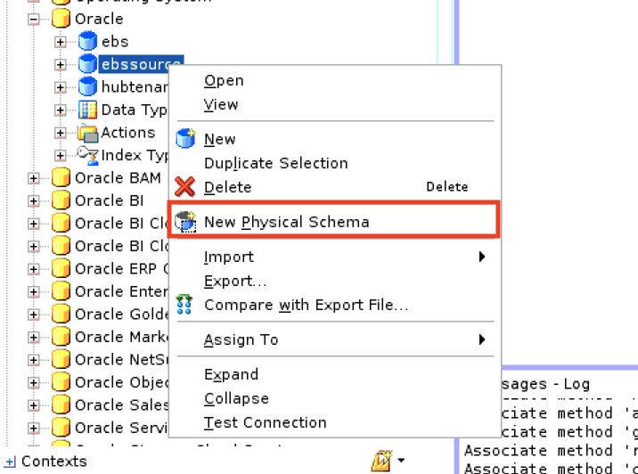
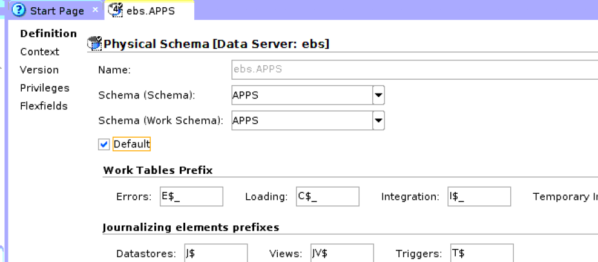
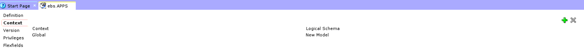
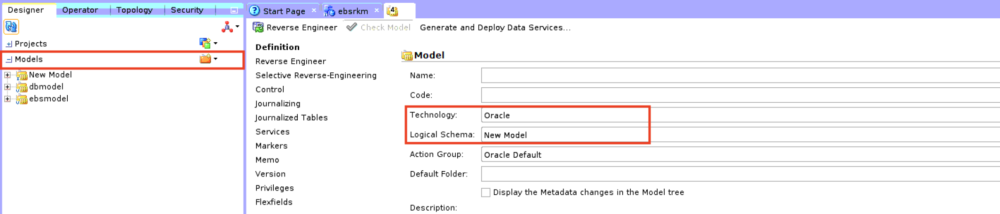
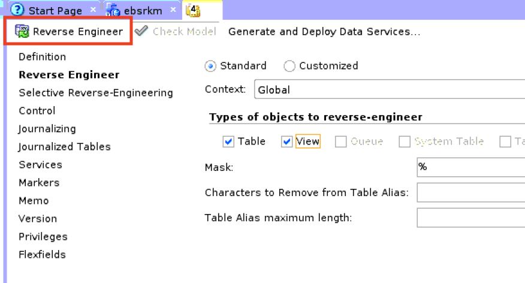
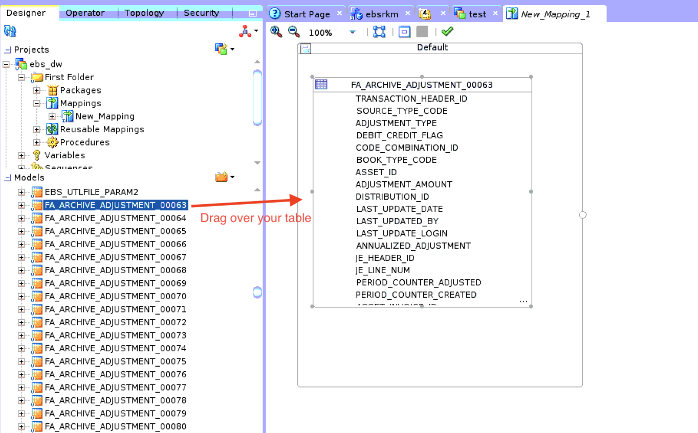
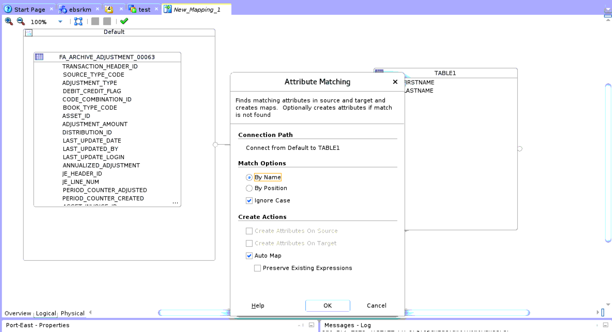
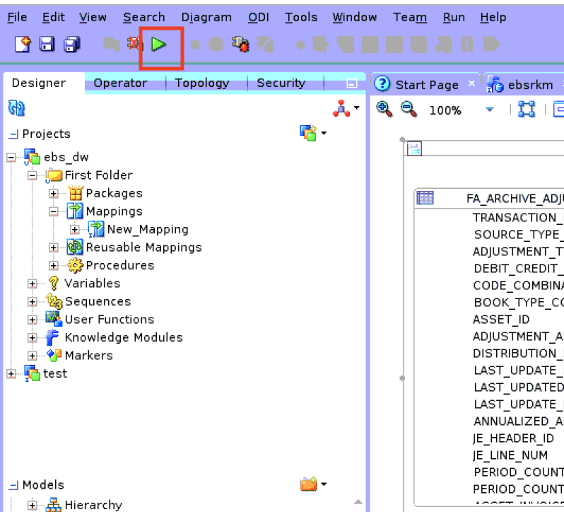
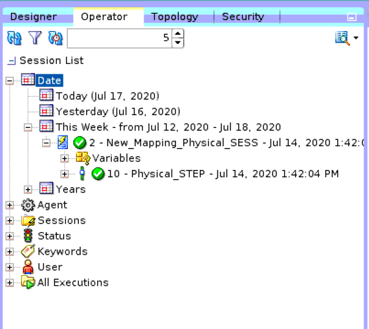

# Configure EBS Source and run integration

## Introduction

In this lab, you will configure your EBS source in ODI, create the mapping, and run the integration.

Oracle Data Integrator is a comprehensive data integration platform that covers all integration requirements: from high-volume, high-performance batch loads, to event-driven, trickle-feed integration processes, to SOA-enabled data services. It offers an extensive graphical environment to build manage, monitor and maintain integration processes resulting in faster and simpler development and maintenance for organization's. We will only scratch the surface of ODI here, but you can read more about ODI [here](https://docs.oracle.com/cd/E17904_01/integrate.1111/e12641/overview.htm#ODIGS111).

<!---To log issues and view the Lab Guide source, go to the [github oracle](https://github.com/oracle/learning-library/issues/new) repository.-->

To log issues, go [here]().

## Objectives

As a system administrator or application developer:

- Rapidly create an integration that moves data from your EBS to a data warehouse that will then be used to run analytics.

## Required Artifacts

- An ODI instance.
- EBS Database credentials, ADW database credentials

## Steps

### STEP 1: Create the EBS Data Server

A data server stores information according to a specific technical logic which is declared into **physical schemas** attached to this data server. Every database server, JMS message file, group of flat files, and so forth, that is used in Oracle Data Integrator, must be declared as a data server. To read more about the ODI topology, click [here](https://docs.oracle.com/middleware/1212/odi/ODIDG/setup_topology.htm#ODIDG171).

-  Log into VNC Viewer and access ODI studio. Connect to your ODI repository and create a Data Server.

-  Under **Topology**, right click on **Oracle** then choose **New Data Server**.

    

- We are adding our ebs database as our source. Fill in the credentials.

    

- Click on the **JDBC** tab on the left and fill in the db hostname/port/servicename. Then click **Test Connection**.

    
    

- Create a **Physical schema**. Then choose your database schema and configure a Logical schema. Select **New Model** and **Save** the file.

    
    
    

### STEP 2: Setting up an Integration Project

Now that you have configured your connection to your source, we will create the mapping and move the data between the two systems. An integration project is composed of several components. These components include organizational objects, such as folder, and development objects such as mappings or variables.

In the **Designer** navigator, click **New Project** in the toolbar of the **Projects** section. Enter the Name of the project, and **Save**.

For more about ODI integration projects, click [here](https://docs.oracle.com/middleware/1212/odi/ODIDG/projects.htm#ODIDG311).

### STEP 3: Creating an Oracle Model and Reverse-Engineering EBS Tables

- We will now create a model based on the logical schema we created. A model is a set of datastores corresponding to data structures contained in the Physical Schema.

- Expand the **Models** panel, Right-click then select **New Model**. Fill in the Name, Technology and the Logical Schema (the values we created earlier should be visible in the dropdowns)

    

- To automatically populate datastores into our model, we need to reverse-engineer our EBS tables. Reverse-engineering uses the capabilities of JDBC driver to connect to data servers (our EBS source tables) and retrieve metadata. Here, we will go with standard reverse engineering, to find and import all our tables and views, but you could be more selective by choosing the custom button or using the Selective Reverse Engineering pane.
- To run the reverse-engineering, click **Reverse Engineer** in the Model toolbar menu.
For more on reverse-engineering EBS tables, click [here](https://docs.oracle.com/middleware/1212/odi/ODIAA/oracle_ebiz_suite.htm#ODIAA556).

    

- When reverse-engineering is complete, you should be able to expand your model and see all the EBS tables that were imported

### STEP 4: Design your Mapping and run the integration

ODI makes it easy to create mappings between your data sources and targets to refine and cleanse the data using both both both ETL and E-LT methods. You can apply extensive filters as you do mappings and more.
We will now create our mapping from our source to the target.

- Go back to the **Projects** section and select your project. Under **First Folder**, go to right-click on **Mappings** and create a new mapping.
- Open the **Models** and find the EBS tables and views. Drag your table to the mapping interface
    
    

- You should have a target model created. Drag your target table over, and connect the two together by name or by position. 'By name' matches the names of the source to the target, and 'By position' matches the columns by their column numbers.

    

- You are now ready to run the integration. Click on the green start button to run your integration.

    

- You can monitor the status of the integration after its completion by navigating to the **Operator** tab, **Date**, and expand on the day of your integration. Upon finishing succesfully, your data should be in the target table.

    

