# Provision Resources

## Introduction

In the lab we will provision the resources required for the next lab. 

## Objectives

Provision a stack comprising of an Autonomous Datawarehouse and an Analytics Cloud instance.

## Required Artifacts

- Access to an Oracle Cloud Infrastructure (OCI) account.
- Necessary permissions to be able provision the stack in a compartment.

### STEP 1: Provision the Autonomous Data Warehouse 

- Login to the OCI console and go the Navigation menu using the Menu button in the top left.

    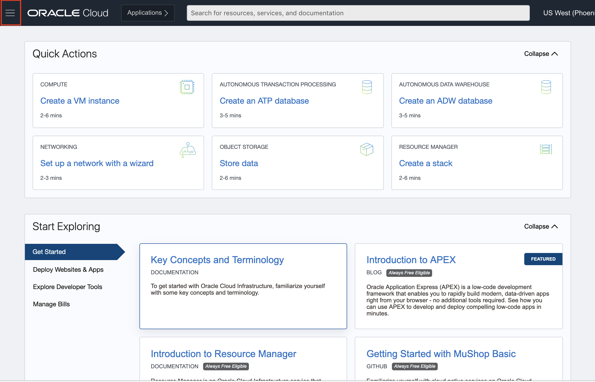

- Choose **Autonomous Data Warehouse** from the **Oracle Database** section.

    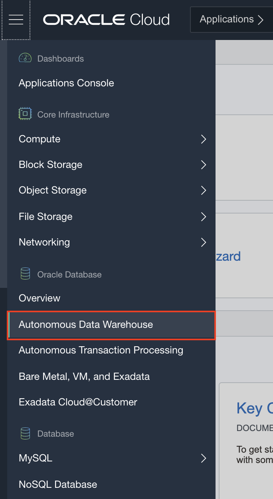

- Click on the **Create Autonomous Database** button. 

    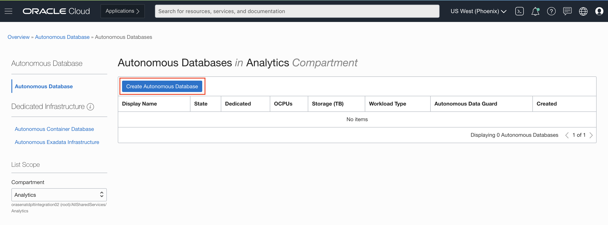

- Choose a compartment, enter the **Display Name** and also enter a name for the **Database**. Leave everything else set to the default values. 

    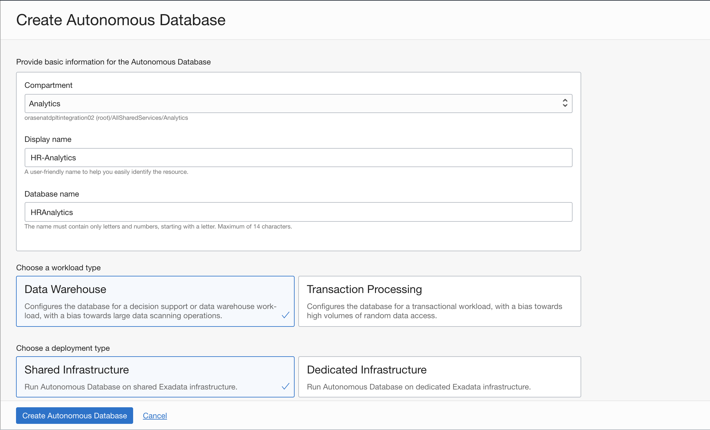

- Scroll down and provide a password for the administrator.

    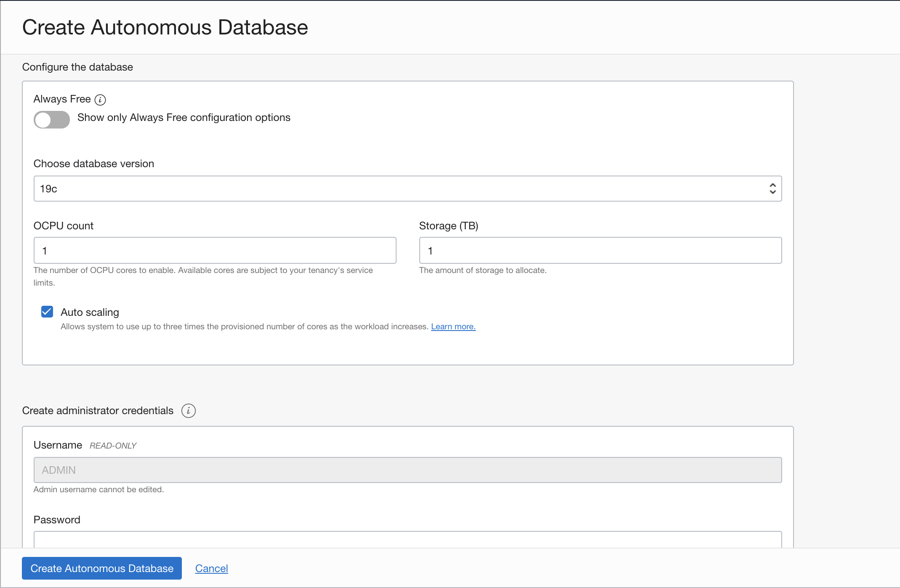

- Thereafter, hit **Create Autonomous Database**.

    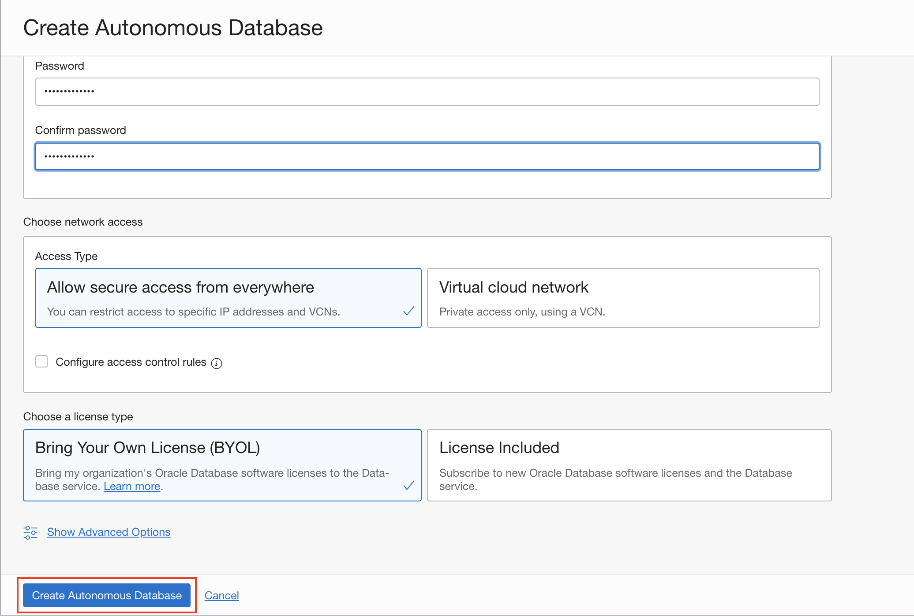

- The database should be up and running in a couple of minutes. 

    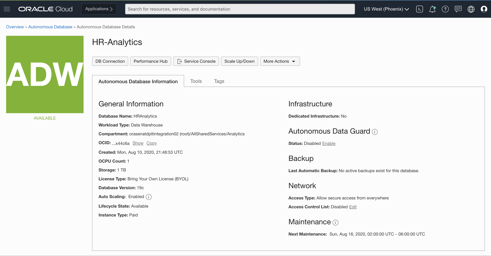

**Note:** Keep this page open or make note of how to get here, since you would need to visit this page for information needed to connect to the database.

### STEP 2: Provision the Analytics Cloud Instance 

- From the Navigation menu, under **Solutions and Platform**, go to **Analytics** and select **Analytics Cloud**.

    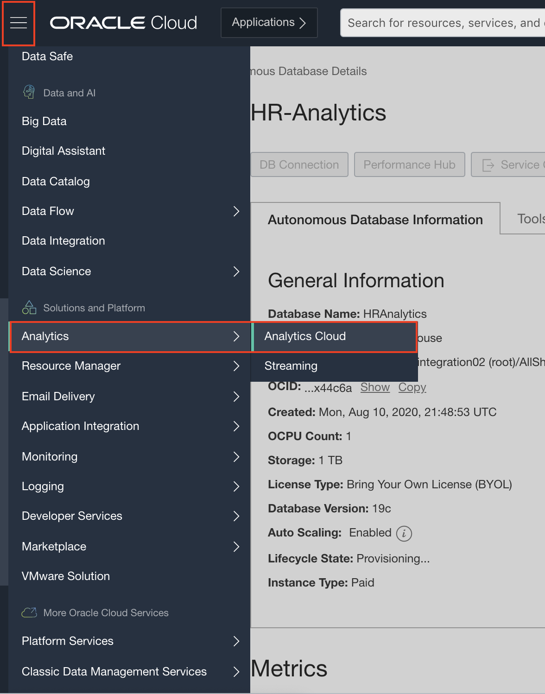

- On the next page, click on the **Create Instance** button. 

    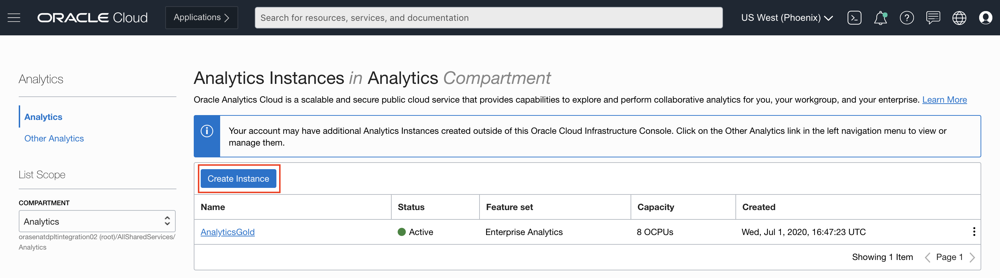

- Choose a compartment and provide a name for the instance. Let everything else stay the same. Then click on **Create**.

    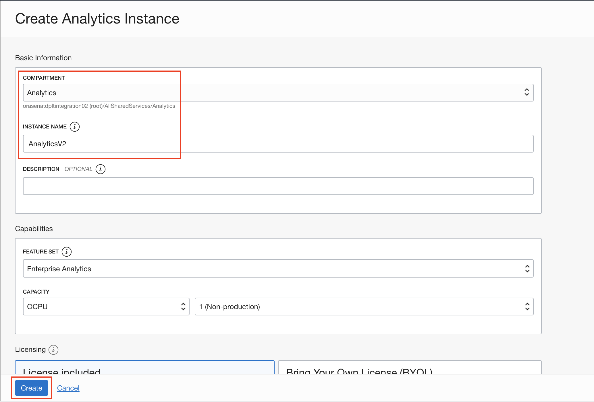

- The instance will be up in 12-14 minutes. Once the instance is available, click on the **Open URL** button to gain access to the instance.

    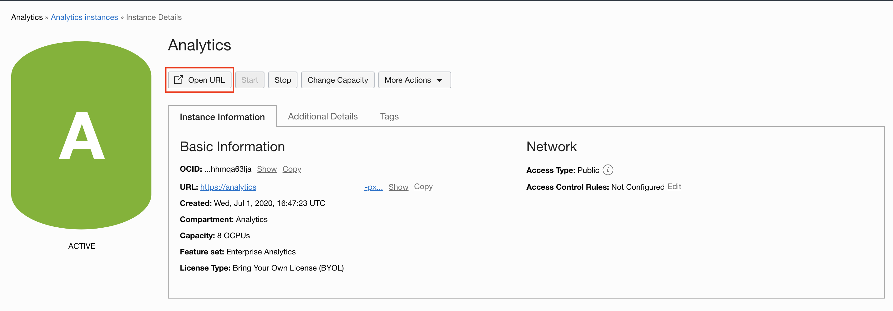
