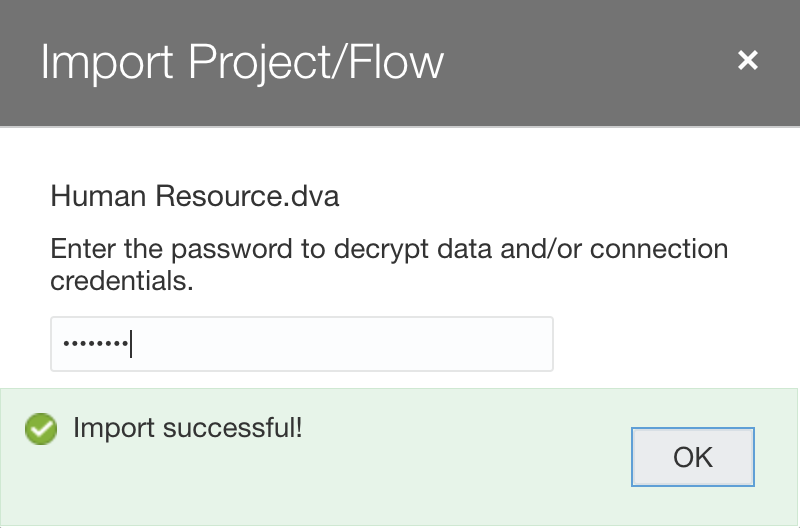
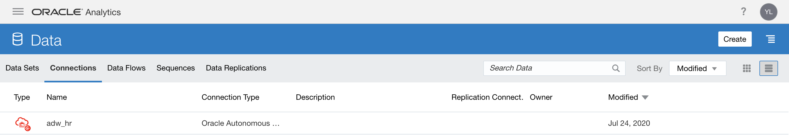

# Run Analytics - Create Dashboards

## Introduction

In this lab, you will use a DVA file to run analytics in Oracle Analytics Cloud.

<!---To log issues and view the Lab Guide source, go to the [github oracle](https://github.com/oracle/learning-library/issues/new) repository.-->

To log issues, go to [here]().

## Objectives

As a system administrator or application developer:

- Create Connection to ADW  
- Upload DVA files and refresh connection + data
- View analytics

## Required Artifacts

- Autonomous Data Warehouse (ADW) and Oracle Analytics Cloud (OAC) instances.
- Access to sql and dva files needed to recreate this demo.

### STEP 1: Installing HR Schema on Autonomous Database

- Use SQL developer to connect to your already provisioned database with the ADMIN user.

- Run the following code to create the HR user.

    

- Now go ahead and log in as the HR user, then run the following [scripts](https://github.com/oracle/db-sample-schemas/tree/master/human_resources) to create the HR schema. Run the hr_main.sql script.

A pair of optional scripts, hr_dn_c.sql and hr_dn_d.sql, is provided as a schema extension. To prepare schema HR for use with the directory capabilities of Oracle Internet Directory, run the hr_dn_c.sql script. If you want to return to the initial setup of schema HR, use script hr_dn_d.sql to undo the effects of script hr_dn_c.sql.
For a complete listing of the scripts and their functions, refer to [this](https://docs.oracle.com/database/121/COMSC/scripts.htm#COMSC00020).

You can use script hr_popul.sql to populate the tables and hr_drop.sql to drop schema HR.

On sql developer, click on any of the tables, and click on *Model*, you should see the table relationships.

    

### STEP 2: Setting up the Human Resource Analytics Project in OAC

-  Log in to your analytics cloud instance. On the far right hamburger menu, select **Import Project/Flow**

-  Import the 'Controlling Project Expenditure Using Machine Learning.dva' file into OAC. The password is **Admin123**. Read more [here](https://docs.oracle.com/en/middleware/bi/analytics-desktop/bidvd/import-application-or-project.html).

    
    
    

- Go to **Data** -> **Connections** and you should see a connection named 'Controlling Project Expenditure'. 

    

- Click on the ellipses menu on the extreme right of the connection’s name and select inspect.

- Click on the **Select** button in front of Client Credentials and select the wallet to your ADW instance. Let the username be **ADMIN** and provide the database password. Click **Save**.

    

- We will now refresh our data sets to utilize our connection. Move to the hamburger menu and select **Data**-> **Data Sets**, you will see all our tables appear below. Go ahead and reload the data.

    

- Now, proceed to the hamburger menu and select **Catalog** and open your project. The visualizations should load, but click **Refresh Data** if needed to refresh the visuals.

    

