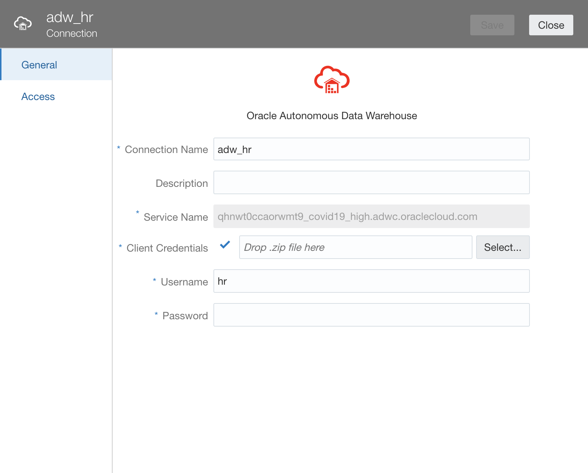
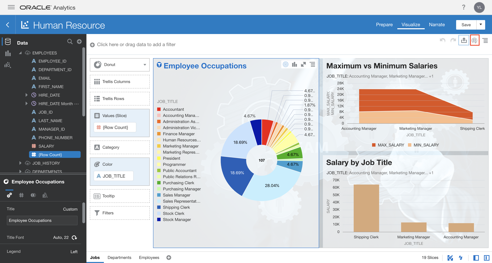

# Run Analytics - Create Dashboards

## Introduction

In this lab, you will use a DVA file to run analytics in Oracle Analytics Cloud.

## Objectives

As a system administrator or application developer:

- Create Connection to ADW  
- Upload DVA files and refresh connection + data
- View analytics

## Required Artifacts

- Autonomous Data Warehouse (ADW) and Oracle Analytics Cloud (OAC) instances.
- Access to sql and dva files needed to recreate this demo.

### STEP 1: ADW Setup

- Log in to your already provisioned autonomous data warehouse (ADW) instance.

- Use SQL developer to connect to your database with the ADMIN user.

- After installing the HR schema, you should be able to see the following tables: EMPLOYEES, LOCATIONS, JOBS, COUNTRIES, DEPARTMENTS, REGIONS, JOB_HISTORY

### STEP 2: Analytics Cloud Setup

-  Log in to your analytics cloud instance. On the far right hamburger menu, select **Import Project/Flow**

-  Import the 'Human Resources.dva' file into OAC. The password is **Admin123**. Read more [here](https://docs.oracle.com/en/middleware/bi/analytics-desktop/bidvd/import-application-or-project.html).

    
    
    

- Go to **Data** -> **Connections** and you should see a connection named 'Controlling Project Expenditure'. 

    

- Click on the ellipses menu on the extreme right of the connection’s name and select inspect.

- Click on the **Select** button in front of Client Credentials and select the wallet to your ADW instance. Let the username be **ADMIN** and provide the database password. Click **Save**.

    

- We will now refresh our data sets to utilize our connection. Move to the hamburger menu and select **Data**-> **Data Sets**, you will see all our tables appear below. Go ahead and reload the data.

    

- Now, proceed to the hamburger menu and select **Catalog** and open your project. The visualizations should load, but click **Refresh Data** if needed to refresh the visuals.

    

### STEP 3: Uploading a file to the Datawarehouse using OAC

- Click on the **Create** button and then select **Data Flow**.

- Select the **Create Data Set**, choose the **Click to Browse** option and select the **AttritionPrediction.csv** file. You may drag and drop the file instead.