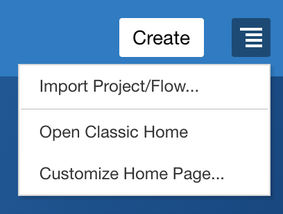
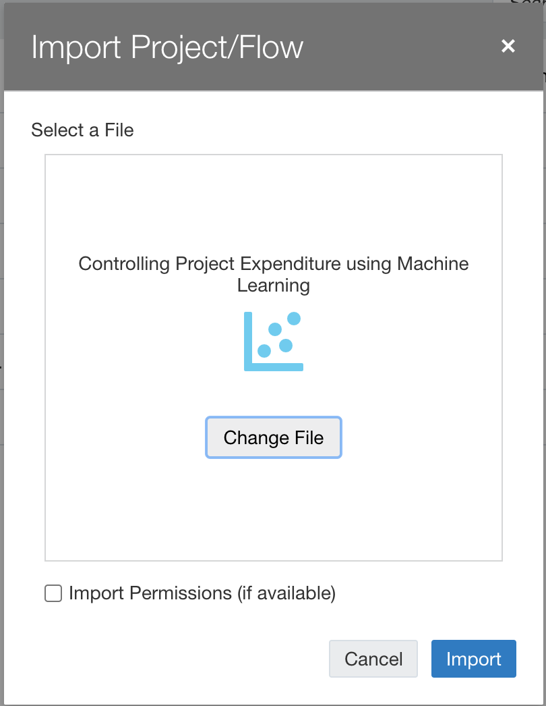
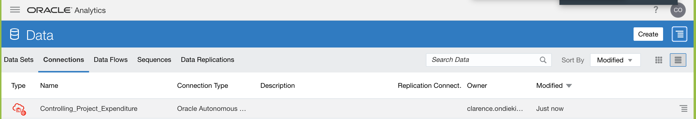
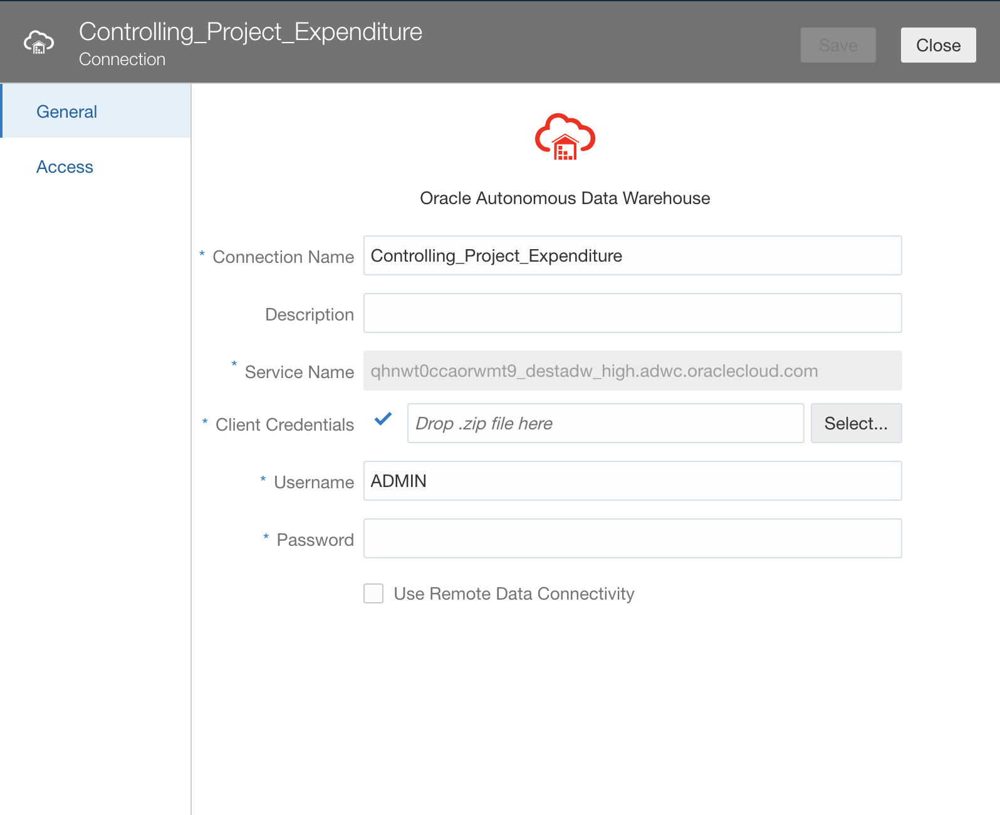

# Run Analytics - Create Dashboards

## Introduction

In this lab, you will use a DVA file to.

<!---To log issues and view the Lab Guide source, go to the [github oracle](https://github.com/oracle/learning-library/issues/new) repository.-->

To log issues, go to [here]().

## Objectives

As a system administrator or application developer:

- Create Connection to ADW  
- Upload DVA files and refresh connection + data
- View analytics

## Required Artifacts

- Autonomous Data Warehouse (ADW) and Oracle Analytics Cloud (OAC) instances.
- Access to sql and dva files needed to recreate this demo.

## Steps

### STEP 1: ADW Setup

- Log in to your autonomous data warehouse (ADW) instance already provisioned.

- Use SQL developer to connect to your database with the ADMIN user.

- Execute the 'controlling_project_expenditure.sql' script to get all the needed tables and data entries. If you are using an existing database make sure that you have no tables under ADMIN with the same names: COST, COUNTRY_FORECAST, PPM_OAC19001_PROJECT_OVERVIEW_BUDGET_VS_ACTUAL, PPM_OAC19001_ROLLED_UP, STEEL_TARIFF, STEEL_TOTAL_COST_FORECAST_

### STEP 2: Analytics Cloud Setup

-  Log in to your analytics cloud link. On the far right hambuger menu, select **Import Project/Flow**

-  Import the 'Controlling Project Expenditure Using Machine Learning.dva' file into OAC. The password is **Admin123**. Read more [here](https://docs.oracle.com/en/middleware/bi/analytics-desktop/bidvd/import-application-or-project.html).

    
    
    

- You should see 

- Go to **Data** -> **Connections** and you should see a connection named 'Controlling Project Expenditure'. 

    

- Click on the ellipses menu on the extreme right of the connection’s name and select inspect.

- Click on the **Select** button in front of Client Credentials and select the wallet to your ADW instance. Let the username be **ADMIN** and provide the database password. Click **Save**

    

- We will not refresh our data sets to utilize our connection. Move to the hambuger menu and select **Data**-> **Data Sets**, you will see all our tables appear below. Go ahead and reload the data.

    

- Now, proceed to the hambuger menu and select **Catalog** and open your project. The visualizations should load, but click **Refresh Data** if needed to refresh the visuals.

    

